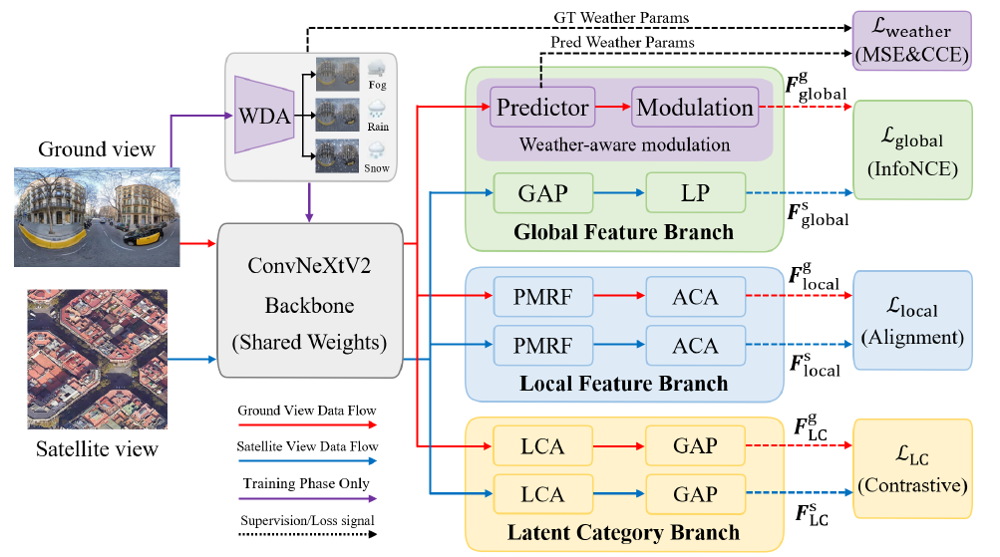

# WMGR-Net: Weather-aware Multi-granularity Representation Learning for Cross-view Geo-Localization under Adverse Conditions

In this repository we present our work: "Weather-aware Multi-granularity Representation Learning for Cross-view Geo-Localization under Adverse Conditions" (WMGR-Net) and provide training and inference code.

[Paper](Coming-Soon) | [Weights](Coming-Soon)


*WMGR-Net Architecture*

> This work targets robust cross-view geo-localization where ground-view images are matched to aerial or satellite imagery under complex weather and appearance changes. We propose a weather-aware multi-granularity framework that jointly learns:
> 
> - A global branch with weather-aware modulation guided by predicted weather cues
> - A geometry-aware local branch with multi-receptive field convolutions and axial context attention
> - A latent category branch that aggregates region features into self-discovered scene prototypes
> 
> A physics-inspired weather domain augmentation strategy simulates realistic weather-induced degradations during training and provides supervision for weather-aware representation learning. The network is optimized with a multi-granularity contrastive objective over global, local and latent representations. Experiments on CVUSA, CVACT and VIGOR show consistent gains over recent state-of-the-art methods, especially for cross-area and cross-dataset generalization under challenging weather conditions.

For training and testing the provided code, download the datasets and extract them as shown in the folder structure. 
Afterwards, for each dataset, a unique train script can be executed (e.g., `train_cvusa.py`, `train_cvact.py`). The pre-trained weights should be extracted into the `pretrained/` folder to run the evaluation scripts.

## Environment Setup

We recommend using [Anaconda](https://www.anaconda.com/) to create a virtual environment for this project.

1. Clone the repository and navigate into it:
   
   ```bash
   git clone <repository_url>
   cd WMGR_Net
   ```

2. Create and activate a new Conda environment:
   
   ```bash
   conda create -n wmgr_net python=3.9 -y
   conda activate wmgr_net
   ```

3. Install PyTorch matching your CUDA version (example for CUDA 11.8):
   
   ```bash
   conda install pytorch torchvision torchaudio pytorch-cuda=11.8 -c pytorch -c nvidia
   ```

4. Install the remaining dependencies:
   
   ```bash
   pip install -r requirements.txt
   ```

## Data Preparation

The publicly available datasets used in this paper can be obtained from the following sources: 

**Preparing CVUSA Dataset.** The dataset can be downloaded [here](https://mvrl.cse.wustl.edu/datasets/cvusa). 

**Preparing CVACT Dataset.** The dataset can be downloaded [here](https://github.com/Liumouliu/OriCNN). 

**Preparing VIGOR Dataset.** The dataset can be downloaded [here](https://github.com/Jeff-Zilence/VIGOR/tree/main). 

**Preparing University-1652 Dataset.** The dataset can be downloaded [here](https://github.com/layumi/University1652-Baseline).

## Folder Structure:

```text
├─ WMGR_Net
  ├── pretrained/
  ├── dataset/
    ├── U1652/
    ├── VIGOR/ 
    ├── CVUSA/    
    └── CVACT/
  ├── evaluate/
  ├── model_wmgr.py
  ├── trainer.py
  └── ...
```

## Parameter Sensitivity Analysis

The overall objective of WMGR-Net involves three balancing coefficients, namely $\lambda_{\mathrm{local}}$, $\lambda_{\mathrm{LC}}$, and $\lambda_{\mathrm{weather}}$. To evaluate the robustness of these loss weights, we conduct a parameter sensitivity analysis on the CVUSA dataset. Specifically, we vary one coefficient at a time while keeping the other two fixed at their default values.

The results show that the default setting, $\lambda_{\mathrm{local}}=0.2$, $\lambda_{\mathrm{LC}}=0.1$, and $\lambda_{\mathrm{weather}}=0.1$, achieves the best R@1. Meanwhile, the performance varies only slightly within a reasonable range of each coefficient, indicating that WMGR-Net is not overly sensitive to the loss weights. This suggests that the retrieval performance mainly benefits from the joint modeling of global, local, and latent structural information in the multi-granularity representation learning framework, rather than from strict hyperparameter tuning.

### Table: Parameter sensitivity analysis of loss balancing coefficients on CVUSA.

| Setting                               | $\lambda_{\mathrm{local}}$ | $\lambda_{\mathrm{LC}}$ | $\lambda_{\mathrm{weather}}$ | R@1       |
|:------------------------------------- |:--------------------------:|:-----------------------:|:----------------------------:|:---------:|
| **Vary $\lambda_{\mathrm{local}}$**   | 0.10                       | 0.10                    | 0.10                         | 98.86     |
|                                       | 0.15                       | 0.10                    | 0.10                         | 99.01     |
|                                       | 0.20                       | 0.10                    | 0.10                         | **99.25** |
|                                       | 0.25                       | 0.10                    | 0.10                         | 99.07     |
|                                       | 0.30                       | 0.10                    | 0.10                         | 98.88     |
| **Vary $\lambda_{\mathrm{LC}}$**      | 0.20                       | 0.050                   | 0.10                         | 98.91     |
|                                       | 0.20                       | 0.075                   | 0.10                         | 99.06     |
|                                       | 0.20                       | 0.100                   | 0.10                         | **99.25** |
|                                       | 0.20                       | 0.125                   | 0.10                         | 98.96     |
|                                       | 0.20                       | 0.150                   | 0.10                         | 98.83     |
| **Vary $\lambda_{\mathrm{weather}}$** | 0.20                       | 0.10                    | 0.050                        | 98.86     |
|                                       | 0.20                       | 0.10                    | 0.075                        | 99.03     |
|                                       | 0.20                       | 0.10                    | 0.100                        | **99.25** |
|                                       | 0.20                       | 0.10                    | 0.125                        | 98.99     |
|                                       | 0.20                       | 0.10                    | 0.150                        | 98.85     |

## Acknowledgements

Our code is built on top of [Sample4Geo](https://github.com/Skyy93/Sample4Geo). We sincerely appreciate their excellent open-source work.

## Citation

If you find our work useful in your research, please consider citing:

```bibtex
@article{wmgrnet2026,
  title={Weather-aware Multi-granularity Representation Learning for Cross-view Geo-Localization under Adverse Conditions},
  author={Anonymous},
  journal={Under Review},
  year={2026}
}
```
